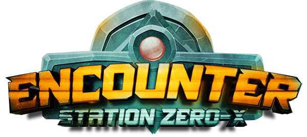

# 🚀 Encounter

<figure><figcaption></figcaption></figure>

[Encounter](https://encounter.station0x.com) is a space-themed 1v1 strategy game similar to chess. It launched in late 2021 and has attracted more than 2,500 [players](community-and-statistics.md) since its closed beta launch.

Gameplay

Mainly, the gameplay consists of two different modes; First, players can compete in the[ Ranked Mode](gameplay/game-modes.md) for gaining more rewards, ...

