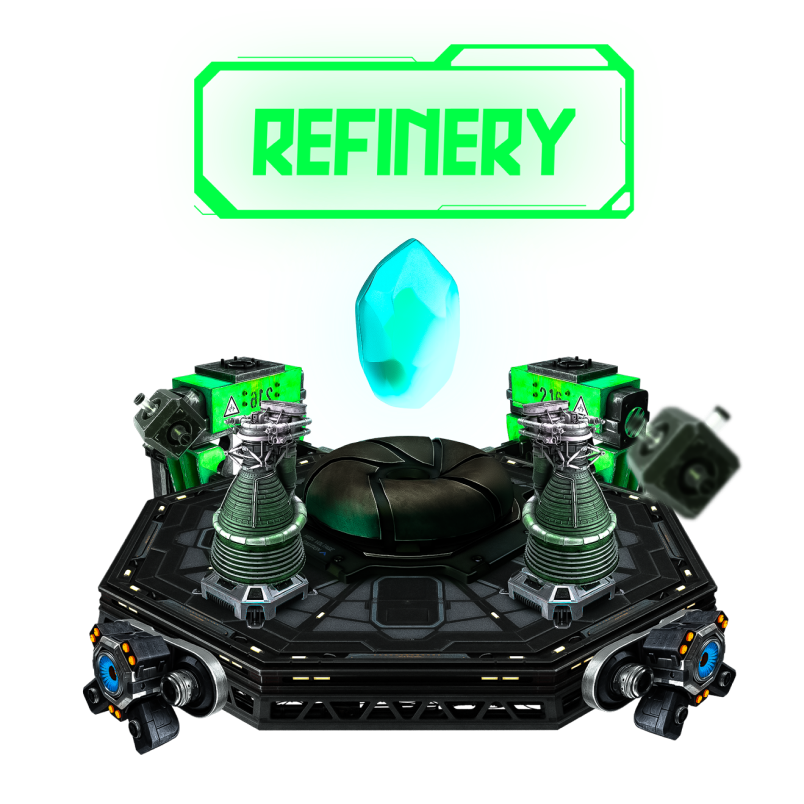

# Economy and Manufacturing

Basically, the economy of the Encounter game is based on Manufacturing, That is, the continuous manufacturing process is what creates the balance in the market between buying and selling the last product, whether it is ores, materials, or a spaceship.

### **First, let's talk about ores:**

Encounter has 4 types of Ores:

<figure><figcaption></figcaption></figure>

Each type of them is rare and cannot be replaced, meaning that each type of them is unique and cannot be dispensed with in the manufacturing process, And in order to get each type, there are several different ways, and each way enables you to get its own type, that is, for example, in order to get Zisek Ores, you have to do daily tasks that are updated weekly.

**Ores issuence is inflationary, and its issues is based on the player Elo.**

## Refinery

&#x20;                                                

Raw ores cannot be used directly to manufacture spaceships, instead it needs to be refined to produce materials that can be used in the Factory.

<figure><figcaption>
Encounter Refinery User Interface
</figcaption></figure>

## Refined Materials

<figure><figcaption></figcaption></figure>

Each ore can be refined to give specific percentages of refined materials (with RNG). Each spaceship requires different amount of Refined Materials to be manufactured. And users can either buy the materials directly from other players or refine his ores in the refinery.

**Refined Material inflation is controlled by a coninous dutch auction contract, as is initially set to 100K material per day.**

## Factory and Manufacturing

&#x20;                                               .png>)

<figure><figcaption>
Encounter Factory User Interface
</figcaption></figure>

Factory is the last step to manufacturing a spaceships. It combine different materials to create a spaceship NFT that the player need in order to own that spaceship and keep playing with it. All spaceships to be manufactured enter a shared queue, each spaceship take 10 mins to be manufactured.\
\
In order to manaufactor a spaceship a player needs:&#x20;

* **The required Refined Materials**
* **Spaceship Blueprint Card**

But the manufacturing process can only include other cards like: **Failure Reduction Card**, **Queue speed-up card** and others.
