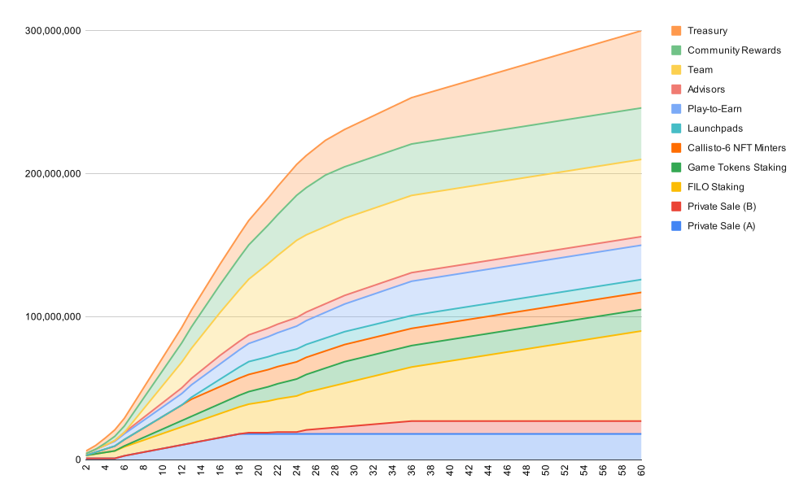

# Release and Vesting Schedule

SZX will be release in a pre-determined schedule which lasts for 60 months from the first Token Generation Event (TGE) on 31th Dec 2022, 12pm GMT.

The initial circulating supply is set to 3,516,667 AXS - **2.67%** of the total supply and will be released gradually each month.

<figure><figcaption>
Illustrates the maximum possible issuance of SZX over the coming years, and the total supply will never exceed <strong>300,000,000.</strong>
</figcaption></figure>

| Private Sale (A)       | 5% TGE, 4m cliff, 10% TGE + 12m vest    |
| ---------------------- | --------------------------------------- |
| Private Sale (B)       | 10% TGE, +15% 3rd mth, 2m cliff vesting |
| FILO Staking           | 60m vest                                |
| Game Tokens Staking    | 5m cliff + 24m vest                     |
| Callisto-6 NFT Minters | 2m cliff, 10% TGE + 10m linear vest     |
| Launchpads             | 15% TGE + 6m linear vest                |
| Play to Earn           | 36m vest                                |
| Advisors               | 4m cliff + 12m vest                     |
| Team                   | 6m cliff + 18m linear vest              |
| Community Rewards      | 3m cliff, 24m vest                      |
| Treasury               | 60m vest                                |
